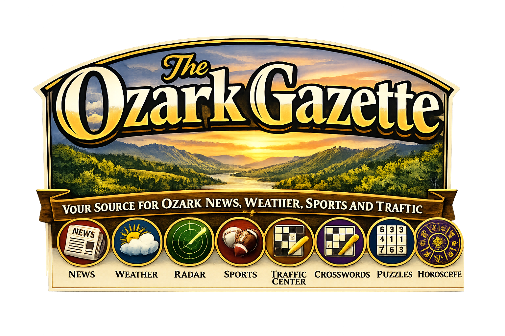

[README.md](https://github.com/user-attachments/files/29497633/README.md)


# The Ozark Gazette v1.0.2 Production Alpha

**Plain-English + Technical README / Operating Manual**  
CGN Shell | Ozark Gazette Local Publishing | Articles + Archives Sheet Routing | CGN LIVE Homepage Takeover | PayPal + Paywall Preservation | Account Access | News Page | Weather Brief | Weather Radar | Traffic Brief | Sports Brief | Markets Brief | Puzzles | Horoscopes | Reporters | Obituaries | Court/Public Records Monitoring | SEO | Favicons | Static GitHub Pages Deployment | Apps Script Extension | One-Week Archive Automation

**Updated:** 30 June 2026 • 08:37:30Z UTC  
**Site Build Stamp:** 30 June 2026 • 08:16:45Z UTC | Developed by Cook Technology Services  
**Site Version:** `Ozark Gazette v1.0 Production Alpha`  
**Site Slug:** `ozark-gazette-v1.0-production-alpha`  
**Apps Script Extension:** `apps-script/OzarkGazette.gs`  
**Apps Script Extension Functions:** `26`  
**Extension doGet / doPost:** `0` / `0`  
**Duplicate Function Declarations:** `0`  
**Repository:** `CookInternational/Ozark-Gazette`  
**Site:** https://ozarks.cgnnews.net

The Ozark Gazette  
P.O. Box 794  
33256 US Highway 160  
Tecumseh, Missouri 65760  
tips@cgnnews.net | https://ozarks.cgnnews.net | +1 (317) 442-1437  
Copyright © 2026 | Cook Global News Network | All Rights Reserved.

---
## What Changed in v1.0.2?

v1.0.2 uploaded and added News Banner image.

## What Changed in v1.0.1?

v1.0.1 is the first production-alpha operating README for **The Ozark Gazette**, a CGN-powered local news site for Tecumseh, Ozark County and the Missouri Ozarks.

This build locks the site at `https://ozarks.cgnnews.net`, documents the Ozark-specific Google Sheet, explains the `OzarkGazette.gs` route extension, and records the current page contract after the shell, weather, markets, homepage, footer, social-icon and news-page fixes.

### Fixed and locked in this build

- Uses `https://ozarks.cgnnews.net` as the production canonical base.
- Uses repo target `CookInternational/Ozark-Gazette`.
- Uses the Ozark Gazette logo in the README and public site branding.
- Keeps the CGN shell, account/paywall behavior, PayPal/payment files and stock-market ticker.
- Uses a custom Ozark Gazette header and footer while preserving the CGN network copyright link.
- Global header top order is locked as `News`, `Weather`, `Radar`, `Traffic`, `Sports`.
- Right-side header tool order is locked as `Account`, `Weather/Time`, `Instagram`, `X`, `YouTube`, `Support`.
- Instagram links to `https://www.instagram.com/cookglobalnews/`.
- YouTube must remain to the right of X in the social group and must not be moved beside Login/Account.
- Weather/Time block is compact, proportional, and does not show a redundant extra Tecumseh line.
- Footer News heading is the News link; no duplicate News item appears under the News heading.
- Homepage keeps the Ozark headline/weather/traffic/sports/markets widget as the default view.
- CGN LIVE opens inside the homepage widget area and takes over the widget; Back to Headlines restores the original Ozark view.
- The separate Watch Local & Regional TV section was removed from underneath the homepage live widget.
- `/news/` exists as an Ozark Gazette news-disambiguation page that loads all published Ozark articles from the Ozark sheet.
- Weather page uses the full CGN Weather-style widget and loads Weather articles only from the Ozark sheet.
- Markets Brief uses the CGN Market Watch-style layout with the Ozark shell and footer.
- Traffic Brief is Tecumseh/Ozark County focused.
- Reporters page includes Michael A. Cook as Editor, `editor@cgnnews.net` only for Michael, and a Newsroom Reporter card.
- `apps-script/OzarkGazette.gs` is documented as a separate extension file, not a replacement for the main CGN backend.
- Active articles move from `Articles` to `Archives` after one week through the Ozark archive job.

---

## 1. Executive Summary

The Ozark Gazette is a production-ready alpha local news website operated by Cook Global News Network. It is built as a static GitHub Pages-style site using CGN infrastructure for shell behavior, account access, PayPal/payment handling, market widgets, weather presentation, article rendering and Apps Script-backed sheet data.

Plain-English explanation: the public site is a local Ozarks newspaper front end. Readers browse Local, US, World, Politics, Investigations, Markets, Technology, Opinion, Environment, Entertainment, Obituaries, Weather, Radar, Traffic, Sports, Horoscopes, Sudoku, Puzzles, Crosswords and Reporters. The site loads published stories from the Ozark Gazette Google Sheet, displays them in category pages and article pages, and keeps current reader tools such as weather/time, stock ticker, CGN LIVE and account access in the global shell.

Technical explanation: the static repo renders pages from HTML, CSS and JavaScript. `assets/ozark-shell.js` injects the global header/footer, account modal, local time/weather widget, stock ticker and shared article helpers. Category pages declare an article grid and category name; the shell calls the Apps Script web app using `site=ozark&action=ozark_articles`. `article.html` loads one article by slug or ID through `ozark_article`. `apps-script/OzarkGazette.gs` is added to the existing CGN Apps Script project as an extension router for Ozark-specific actions and reads the separate Ozark Gazette spreadsheet.

---

## 2. Build Lock

| Item | Current value |
|---|---|
| Site version | `Ozark Gazette v1.0.1 Production Alpha` |
| Site build stamp | `2026-06-30T08:16:45Z` |
| README updated | `30 June 2026 • 08:16:45Z UTC` |
| Production site | `https://ozarks.cgnnews.net` |
| Repository | `CookInternational/Ozark-Gazette` |
| Public brand | `The Ozark Gazette` |
| Operator | `Cook Global News Network` |
| Developer | `Cook Technology Services` |
| Primary contact | `tips@cgnnews.net` |
| Editor contact | `editor@cgnnews.net` for Michael A. Cook only |
| Apps Script extension source | `apps-script/OzarkGazette.gs` |
| Apps Script extension functions | `26` |
| Extension doGet / doPost | `0` / `0` |
| Duplicate extension functions | `0` |
| Apps Script Web App URL | `https://script.google.com/macros/s/AKfycbx41mQg-Ine3XZ-VrMI_SaQn4_K6cDQHA0cBFyGPgupu_edNFoNRjSLv2hoSe_bOytt/exec` |
| Ozark spreadsheet ID | `1Xz9bnMqb-tkHeo2N2UonUbBr1jpo1VzKcVbBW_PU2n0` |
| Active source tab | `Articles` |
| Archive source tab | `Archives` |
| Archive age | `168 hours` / one week |
| Default hero image | `https://ozarks.cgnnews.net/OzarkGazetteBanner.png` |

Critical controls:

- Do not replace the main CGN Apps Script backend with the Ozark extension.
- Do not add a second `doGet` or `doPost` in `OzarkGazette.gs`.
- Do not route Ozark pages to the main CGN `Articles` sheet unless the page intentionally links externally.
- Ozark article feeds must call `action=ozark_articles` with `site=ozark`.
- Ozark single-article loads must call `action=ozark_article` with `site=ozark`.
- Do not reintroduce `ozarkgazette.com` until that domain is explicitly reactivated.
- Do not remove PayPal, paywall, account, stock ticker, weather/time, CGN LIVE, social icons, footer legal links or CGN network copyright.
- Do not remove YouTube or move it away from the social icon group.
- Do not duplicate News in the footer.
- Public-facing pages must not contain development notes or backend/audit language.

---

## 3. Repository Layout

| Path | Role |
|---|---|
| `index.html` | Homepage with Ozark live/headline widget and CGN LIVE takeover. |
| `news/index.html` | News disambiguation page; loads all Ozark Gazette published articles. |
| `article.html` | Dynamic article reader for Ozark Gazette sheet articles. |
| `assets/ozark-shell.js` | Ozark global shell: header, footer, account modal, weather/time, stock ticker, article helpers. |
| `assets/ozark-site.css` | Global Ozark layout, shell, footer, widgets, article cards and responsive behavior. |
| `assets/cgn-payments.js` | Preserved CGN payment/PayPal behavior. |
| `apps-script/OzarkGazette.gs` | Ozark-specific Apps Script route extension. |
| `apps-script/OZARK_ROUTER_HOOK.txt` | Router integration snippet for the main CGN Apps Script dispatcher. |
| `OzarkGazetteLogo.png` | Site logo and README image. |
| `OzarkGazetteBanner.png` | Masthead/banner and default article image. |
| `favicon.ico`, `favicon-48x48.png`, `favicon-96x96.png`, `apple-touch-icon.png`, `android-chrome-*`, `site.webmanifest` | Browser, Google, Apple and Android icons. |
| `weather/index.html` | Tecumseh Weather Brief using full CGN Weather-style widget. |
| `weather/radar/index.html` | Weather Radar route when present; Weather subpage, not article category. |
| `traffic/index.html` | Tecumseh / US-160 / MO-5 / Ozark County Traffic Brief. |
| `sports/index.html` | Ozark County Sports Brief. |
| `markets/index.html` | Markets category page. |
| `markets/center/index.html` | Markets Brief / Market Watch-style dashboard. |
| `reporters/index.html` | Ozark Gazette staff directory. |
| `about/index.html` | About The Ozark Gazette. |
| `contact/index.html` | Contact page. |
| `support/index.html` | Support page. |
| `local`, `us`, `world`, `politics`, `investigations`, `technology`, `opinion`, `environment`, `entertainment`, `obituaries` | Category routes. |
| `horoscopes`, `sudoku`, `puzzles`, `crosswords` | Reader feature routes. |
| `reproters/index.html` | Typo redirect to `/reporters/`. |
| `robots.txt`, `sitemap.xml` | SEO discovery files. |
| `README.md` | This operating manual. |

---

## 4. Public Route Contract

| Route | Type | Data source |
|---|---|---|
| `/` | Homepage | Ozark `Articles` through shell helpers. |
| `/news/` | All-news disambiguation | Ozark `Articles`. |
| `/local/` | Category page | Ozark `Articles`, category `Local`. |
| `/us/` | Category page | Ozark `Articles`, category `US`. |
| `/world/` | Category page | Ozark `Articles`, category `World`. |
| `/politics/` | Category page | Ozark `Articles`, category `Politics`. |
| `/investigations/` | Category page | Ozark `Articles`, category `Investigations`. |
| `/markets/` | Category page | Ozark `Articles`, category `Markets`. |
| `/markets/center/` | Markets Brief | TradingView widgets + Ozark `Markets` articles. |
| `/technology/` | Category page | Ozark `Articles`, category `Technology`. |
| `/opinion/` | Category page | Ozark `Articles`, category `Opinion`. |
| `/environment/` | Category page | Ozark `Articles`, category `Environment`. |
| `/entertainment/` | Category page | Ozark `Articles`, category `Entertainment`. |
| `/obituaries/` | Category page | Ozark `Articles`, category `Obituaries`. |
| `/weather/` | Weather Brief | Weather widget + Ozark `Weather` articles. |
| `/weather/radar/` | Weather Radar | Weather subpage; not an article category. |
| `/traffic/` | Traffic Brief | Traffic page + Ozark `Traffic` articles. |
| `/sports/` | Sports Brief | Sports page + Ozark `Sports` articles. |
| `/horoscopes/` | Reader feature | Static feature page. |
| `/sudoku/` | Reader feature | Static feature page. |
| `/puzzles/` | Reader feature hub | Static feature page. |
| `/crosswords/` | Reader feature | Static feature page. |
| `/reporters/` | Staff directory | Static staff cards. |
| `/about/` | About page | Static. |
| `/contact/` | Contact page | Static. |
| `/support/` | Support page | Static. |
| `/account/` | Account handoff | Preserved CGN-style account flow. |
| `/article.html?slug=...` | Article view | Ozark `Articles` then `Archives`. |
| `/reproters/` | Redirect | Redirects to `/reporters/`. |

---

## 5. Global Shell Contract

The shell is owned by:

```text
/assets/ozark-shell.js
/assets/ozark-site.css
```

### Header order

The top header category row is locked:

```text
News → Weather → Radar → Traffic → Sports
```

Radar links to:

```text
/weather/radar/
```

### Right-side tool order

The right-side header tools are locked:

```text
Account → Weather/Time → Instagram → X → YouTube → Support
```

Rules:

- Instagram appears before X.
- Instagram links to `https://www.instagram.com/cookglobalnews/`.
- X links to Cook Global News / CGN News X account.
- YouTube appears immediately to the right of X.
- YouTube must not be placed to the left of Login/Account.
- Support remains the last icon.
- Weather/Time is compact and proportional.
- Weather/Time should not repeat an extra `Tecumseh` line under the already localized weather text.
- The shell must wrap proportionally on every screen size without clipping, horizontal overflow or icons scrolling over each other.

### Footer rules

The footer is custom to The Ozark Gazette but preserves CGN network identity.

Locked footer behavior:

- The CGN logo mark links to `https://www.cgnnews.net/`.
- The tagline appears on two lines:

```text
Real-Time News.
Global Perspective.
```

- The copyright line links to the CGN copyright page.
- The News column heading itself links to `/news/`.
- Do not add a second redundant `News` link underneath the News heading.
- Footer contact block uses The Ozark Gazette address and `tips@cgnnews.net`.

---

## 6. Homepage Contract

The homepage is owned by:

```text
/index.html
```

The homepage default state is the **Ozark headline widget**, not CGN LIVE.

Default homepage stack:

1. Ozark Gazette masthead banner.
2. Global shell header and market ticker.
3. Ozark live/headline widget.
4. Feature story panel.
5. Tecumseh weather widget.
6. Traffic widget for US-160 / MO-5 / Ozark County roads.
7. Ozark County sports widget.
8. Markets widget.
9. Latest articles grid loaded from Ozark `Articles`.
10. Obituaries strip.
11. Courts & Public Records strip.
12. Puzzles & Daily Features strip.
13. Global shell footer.

### CGN LIVE takeover behavior

The **CGN LIVE** button in the homepage live header does not open a separate section below the widget. It must take over the widget area.

Expected behavior:

- Click **CGN LIVE**: the headline/weather/traffic/sports/markets widget hides and the CGN LIVE video module appears in the same widget area.
- Use source buttons to switch CGN LIVE feeds.
- Click **Back to Headlines**: CGN LIVE hides and the original Ozark headline widget returns.
- No duplicate Watch Local & Regional TV block appears underneath the live widget.

CGN LIVE feed options include CGN, CGN Weather, World, Politics, Business, Markets, Technology, Local, Weather, Sports and Ozarks/Missouri/St. Louis regional source links where included.

---

## 7. Data Source Contract

The Ozark Gazette uses a separate Google Sheet from the main CGN News site.

```text
Spreadsheet ID: 1Xz9bnMqb-tkHeo2N2UonUbBr1jpo1VzKcVbBW_PU2n0
Tabs: Articles, Archives
```

### Active articles

`Articles` is the live publishing tab. Public routes read from this tab first.

### Archives

`Archives` is the older-story tab. Articles move from `Articles` to `Archives` after one week.

### Article schema

The sheet should use this header row:

```text
article_id
title
subtitle
slug
category
tags
author
published_at
updated_at
summary
body_html
what_this_means
hero_image_url
image_credit
inline_images
featured
breaking
views
status
seo_title
seo_description
display_order
```

### Category values

Canonical article categories for the Ozark sheet:

```text
Local
US
World
Politics
Investigations
Markets
Technology
Opinion
Environment
Entertainment
Obituaries
Weather
Sports
Traffic
```

Weather Radar is not an article category. It is a Weather subpage.

---

## 8. Front-End Data Flow

### Shell config

`assets/ozark-shell.js` defines:

```js
const API_BASE = "https://script.google.com/macros/s/AKfycbx41mQg-Ine3XZ-VrMI_SaQn4_K6cDQHA0cBFyGPgupu_edNFoNRjSLv2hoSe_bOytt/exec";
const SITE = "ozark";
```

It exposes:

```js
window.CGN_API_BASE
window.CGN_API_URL
window.CGN_CONFIG
window.OzarkGazette
```

### Feed request pattern

All normal Ozark feeds should use:

```text
?action=ozark_articles&site=ozark
```

Category pages add:

```text
&category=Local
&category=Weather
&category=Markets
```

Single articles use:

```text
?action=ozark_article&site=ozark&slug=ARTICLE_SLUG
```

Archive feeds use:

```text
?action=ozark_archives&site=ozark
```

### Important regression rule

Do not fall back to:

```text
?action=articles
```

on Ozark pages. That route may return the main CGN News article sheet instead of The Ozark Gazette sheet.

---

## 9. Apps Script Extension Contract

The Apps Script extension is:

```text
apps-script/OzarkGazette.gs
```

This file is an add-on extension for the existing CGN Apps Script project. It is not a standalone web app by itself.

### Function inventory

| Function | Purpose |
|---|---|
| `ozarkGazetteRoute_(payload)` | Entry point from the main CGN router. Returns null for non-Ozark actions. |
| `OGZ_handleAction_(payload)` | Dispatches Ozark actions. |
| `OGZ_health_()` | Health/status check. |
| `OGZ_ss_()` | Opens the Ozark spreadsheet by ID. |
| `OGZ_sheet_(name)` | Gets a required tab by name. |
| `OGZ_headerMap_(sheet)` | Maps sheet headers to column indexes. |
| `OGZ_get_(row,h,name)` | Reads a field by header name. |
| `OGZ_safe_(v)` | String normalization helper. |
| `OGZ_bool_(v)` | Boolean normalization helper. |
| `OGZ_slugify_(v)` | Slug helper. |
| `OGZ_time_(v)` | Date/time parser helper. |
| `OGZ_rowToArticle_(row,h,source)` | Converts a sheet row into the article payload expected by pages. |
| `OGZ_readSheet_(sheetName,payload)` | Reads, filters, sorts and paginates a sheet. |
| `OGZ_articles_(payload)` | Reads active `Articles`. |
| `OGZ_archives_(payload)` | Reads `Archives`. |
| `OGZ_article_(payload)` | Finds one article by slug, ID or article_id across Articles then Archives. |
| `OGZ_moveOldArticlesToArchives_(payload)` | Moves published rows older than one week into Archives. |
| `OGZ_createArchiveTrigger_()` | Creates the daily archive trigger. |
| `OGZ_deleteArchiveTrigger_()` | Deletes the Ozark archive trigger. |
| `OGZ_archiveTriggerStatus_()` | Returns archive trigger status. |
| `OGZ_archiveDailyJob()` | Trigger handler for daily archive movement. |
| `OGZ_sourceRegistry_()` | Returns source registry groups. |
| `OGZ_obituarySources_()` | Returns obituary monitoring sources. |
| `OGZ_courtSources_()` | Returns court/public-record sources. |
| `OGZ_trafficSources_()` | Returns traffic/public-safety road sources. |
| `OGZ_weatherSources_()` | Returns weather/radar/forecast sources. |

### Public Ozark actions

| Action | Response |
|---|---|
| `ozark_health` | Site status, URL, spreadsheet ID, tab list and checked timestamp. |
| `ozark_articles` | Published articles from the active Articles tab. Supports `category`, `limit`, `offset`. |
| `ozark_archives` | Archived articles from the Archives tab. Supports `category`, `limit`, `offset`. |
| `ozark_article` | Single article from Articles or Archives by slug/ID. |
| `ozark_move_old_articles` | Manual archive migration. |
| `ozark_archive_move_old_articles` | Alias for archive migration. |
| `ozark_archive_trigger_create` | Installs the daily archive trigger. |
| `ozark_archive_trigger_delete` | Deletes the daily archive trigger. |
| `ozark_archive_trigger_status` | Returns trigger status. |
| `ozark_sources` | Returns obituary, court, traffic and weather source registries. |
| `ozark_obituary_sources` | Obituary source list. |
| `ozark_court_sources` | Court source list. |

### Router hook

Add this inside the existing CGN Apps Script route handler after payload/action normalization and before the default route response:

```js
var ozarkResponse = ozarkGazetteRoute_(payload);
if (ozarkResponse) return jsonOutput_(ozarkResponse);
```

If the CGN project uses a different JSON helper name, return `ozarkResponse` through the existing project JSON output helper.

### Why `OzarkGazette.gs` has no doGet/doPost

The Ozark file is designed to run inside the already deployed CGN Apps Script project. The main project owns `doGet(e)` and `doPost(e)`. The Ozark file only contributes route handlers and helper functions. This prevents duplicate web-app entry points and keeps the CGN Web App URL stable.

---

## 10. Archive Automation Contract

Archive age:

```text
168 hours
```

Archive movement:

```text
Articles → Archives
```

Archive job:

```js
OGZ_archiveDailyJob()
```

Trigger creation action:

```text
?action=ozark_archive_trigger_create&site=ozark
```

Manual dry run:

```text
?action=ozark_move_old_articles&site=ozark&dry_run=true
```

Manual live run:

```text
?action=ozark_move_old_articles&site=ozark
```

Rules:

- Only `published` rows are eligible for automatic movement.
- Drafts and non-published rows are skipped.
- Existing `article_id` rows already in Archives are not duplicated.
- Rows older than 168 hours move to Archives and are deleted from Articles after successful copy.
- `status` is set to `archived` when the Archives tab contains a `status` column.
- The function uses a script lock to prevent overlapping archive jobs.

---

## 11. Page Contracts

### News page

`/news/` is the all-news disambiguation page. It loads all published Ozark articles and supports search/filter behavior.

Locked rules:

- It must use Ozark Gazette branding.
- It must load `ozark_articles` only.
- It must not use the main CGN News `action=articles` fallback.
- It should filter/search title, subtitle, summary, category, tags, author, body preview and SEO fields when present.

### Weather Brief

`/weather/` uses the full CGN Weather-style widget restored for Tecumseh, Missouri.

It must include:

- Current weather card.
- Saved cities behavior where present.
- Imperial/Metric toggle where present.
- Alert ticker.
- Next 12 Hours.
- Extended Forecast.
- Weather article grid.
- Load more behavior.
- Ozark sheet Weather article loading.

### Weather Radar

`/weather/radar/` is part of Weather.

Default focus:

```text
Tecumseh, Missouri / Ozark County / Missouri Ozarks / US Highway 160 corridor
```

### Traffic Brief

`/traffic/` focuses on:

```text
Tecumseh, Missouri
US Highway 160
MO-5
Ozark County roads
Gainesville
Theodosia
Bakersfield
Dora
Thornfield
Isabella
Pontiac
Wasola
Udall
```

### Sports Brief

`/sports/` focuses on Ozark County and Missouri Ozarks sports, including local high schools, regional sports and relevant college/pro team context.

### Markets Brief

`/markets/center/` uses the CGN Market Watch pattern with TradingView market widgets and Ozark Gazette Markets articles.

### Reporters

`/reporters/` includes:

- Michael A. Cook as Editor.
- Michael uses `editor@cgnnews.net`.
- All other reporters use `tips@cgnnews.net`.
- Current non-Michael Editor from the original template becomes Staff Reporter.
- Newsroom Reporter card uses the Ozark Gazette logo and describes automated briefs in a human-reader-facing way.

---

## 12. Source Registry Contract

The Apps Script extension exposes source registries. These are discovery/support registries, not automatic publication permission.

### Obituaries

Current source registry:

- Ozark County Times Obituaries.
- Robertson-Drago Funeral Home Obituaries.

Rules:

- Obituaries require respectful tone.
- Source attribution is required.
- Do not sensationalize family-provided memorial language.
- Do not publish invasive details beyond what a source has already published.
- Use duplicate detection before publication.
- Use editorial review before publishing sensitive death notices.

### Courts and public records

Current source registry:

- Missouri Case.net.
- Missouri Courts.
- Ozark County Times Court News as secondary local context.

Rules:

- Use official court sources where possible.
- Filter to Ozark County when automating local court coverage.
- Do not publish sealed, juvenile, expunged or restricted records.
- Use neutral language: charged, accused, pleaded, court records show.
- Do not imply guilt before conviction.
- Sensitive cases require manual review.

### Traffic

Current source registry:

- MoDOT Traveler Information.
- Missouri State Highway Patrol crash reports.

Rules:

- Do not claim a crash, closure, flooding event or road restriction unless supported by an official or reliable source.
- Traffic pages can link readers to official sources and summarize monitored corridors.
- Do not tell readers to use live traffic pages while driving.

### Weather

Current source registry:

- National Weather Service Springfield.
- NWS Radar.
- Open-Meteo.

Rules:

- Weather alerts require official NWS/NOAA support.
- Weather widgets may use Open-Meteo structured data.
- Radar routes must remain under Weather.
- Do not invent warnings, watches, alerts or public-safety instructions.

---

## 13. SEO and Metadata Contract

Canonical base:

```text
https://ozarks.cgnnews.net/
```

Default site title:

```text
The Ozark Gazette | Ozark News, Weather, Sports and Traffic
```

Default description:

```text
The Ozark Gazette delivers local news, weather, radar, traffic, sports, markets, obituaries, court coverage, opinion, puzzles and community reporting for Tecumseh, Ozark County and the Missouri Ozarks.
```

Publisher:

```text
The Ozark Gazette
```

Operator/legal network:

```text
Cook Global News Network
```

Favicons and manifest files must remain at the repo root.

Required icon files:

```text
/favicon.ico
/favicon.svg
/favicon-16x16.png
/favicon-32x32.png
/favicon-48x48.png
/favicon-96x96.png
/apple-touch-icon.png
/android-chrome-192x192.png
/android-chrome-512x512.png
/site.webmanifest
```

---

## 14. Deployment Runbook

1. Upload the static repo to `CookInternational/Ozark-Gazette`.
2. Confirm `index.html` is at the repository root.
3. Confirm `OzarkGazetteLogo.png` and `OzarkGazetteBanner.png` are at the repository root.
4. Confirm `/assets/ozark-shell.js` and `/assets/ozark-site.css` are present.
5. Confirm `/news/index.html` exists.
6. Confirm `/weather/index.html`, `/traffic/index.html`, `/sports/index.html`, `/markets/center/index.html`, `/reporters/index.html`, `/about/index.html`, `/contact/index.html` and `/support/index.html` exist.
7. Confirm favicon files and `site.webmanifest` are at the repo root.
8. Confirm `robots.txt` and `sitemap.xml` use `https://ozarks.cgnnews.net`.
9. Add `apps-script/OzarkGazette.gs` as a separate file inside the existing CGN Apps Script project.
10. Add the router hook from `apps-script/OZARK_ROUTER_HOOK.txt` to the main route handler.
11. Deploy the Apps Script Web App as a new version.
12. Test `?action=ozark_health&site=ozark`.
13. Test `?action=ozark_articles&site=ozark&limit=5`.
14. Test `?action=ozark_articles&site=ozark&category=Weather`.
15. Test `?action=ozark_article&site=ozark&slug=...` with a known slug.
16. Run `?action=ozark_archive_trigger_status&site=ozark`.
17. If no archive trigger exists, run `?action=ozark_archive_trigger_create&site=ozark`.
18. Confirm the homepage loads Ozark articles from the Ozark sheet.
19. Confirm Weather, Markets, Traffic and Sports pages do not show main CGN News articles unless deliberately linked externally.
20. Confirm CGN LIVE takeover and Back to Headlines behavior on desktop and mobile.
21. Confirm header order and social icon order.
22. Confirm footer News heading is linked and not duplicated.
23. Confirm the copyright link points to CGN News copyright.
24. Confirm account/paywall/PayPal files were not removed.

---

## 15. Acceptance Tests

The build is acceptable when:

- README shows `Ozark Gazette v1.0.1` as the current build.
- README timestamp is `30 June 2026 • 08:16:45Z UTC`.
- Site canonical base is `https://ozarks.cgnnews.net/`.
- No page uses `ozarkgazette.com` as canonical.
- Header top categories display `News`, `Weather`, `Radar`, `Traffic`, `Sports`.
- Radar links to `/weather/radar/`.
- Right-side tools display `Account`, `Weather/Time`, `Instagram`, `X`, `YouTube`, `Support`.
- YouTube is immediately to the right of X.
- YouTube is not beside Login/Account.
- Instagram links to `https://www.instagram.com/cookglobalnews/`.
- Weather/Time block is compact and has no redundant extra Tecumseh line.
- Footer News heading links to `/news/`.
- Footer does not contain a duplicate News link beneath News.
- CGN footer logo links to `https://www.cgnnews.net/`.
- Footer tagline reads `Real-Time News.` then `Global Perspective.` on two lines.
- `/news/` loads Ozark Gazette articles from the Ozark sheet.
- Weather page loads Weather articles from `ozark_articles`, not main CGN `articles`.
- Markets Brief shell/header/footer render correctly.
- Homepage CGN LIVE takes over the widget area when selected.
- Back to Headlines restores the Ozark headline widget.
- `apps-script/OzarkGazette.gs` has no `doGet` or `doPost`.
- `apps-script/OzarkGazette.gs` has 26 function declarations and no duplicate function names.
- `ozark_health` returns the Ozark site, URL and spreadsheet ID.
- `ozark_articles` returns rows from `Articles`.
- `ozark_archives` returns rows from `Archives`.
- `ozark_article` checks `Articles` first and `Archives` second.
- Archive movement skips drafts and moves published rows older than 168 hours.
- PayPal, paywall and account behavior remain present.
- No public page contains backend/dev/audit language.

---

## 16. Emergency Troubleshooting

### If Ozark pages show CGN News articles

Check for unsafe fallback fetches:

```text
?action=articles
```

Replace with:

```text
?action=ozark_articles&site=ozark
```

For single-article pages, use:

```text
?action=ozark_article&site=ozark&slug=...
```

### If the Apps Script route returns unknown action

Confirm the main router calls:

```js
var ozarkResponse = ozarkGazetteRoute_(payload);
if (ozarkResponse) return jsonOutput_(ozarkResponse);
```

Confirm this happens after `payload.action` is normalized.

### If Apps Script shows duplicate `doGet` or `doPost`

The Ozark extension was pasted incorrectly. Remove any `doGet` or `doPost` from `OzarkGazette.gs`. The main CGN backend owns the web-app entry points.

### If archive movement does not run

Test:

```text
?action=ozark_archive_trigger_status&site=ozark
```

If inactive, run:

```text
?action=ozark_archive_trigger_create&site=ozark
```

Then dry-run movement:

```text
?action=ozark_move_old_articles&site=ozark&dry_run=true
```

### If articles disappear after archive movement

Check the `Archives` tab for matching `article_id`. The move function copies the row to Archives and deletes the original row from Articles only after building the destination row.

### If category pages show nothing

Confirm the sheet category value exactly matches the route category. For example, `/weather/` expects `Weather`, `/markets/` expects `Markets`, `/obituaries/` expects `Obituaries`.

### If the homepage feature story does not update

Confirm the homepage has `body data-page="home"`, the `featureTitle`, `featureMeta`, `featureCopy`, `featureImage`, `featureLink` IDs, and `homeArticles`, `obitStrip`, `courtStrip` mounts.

### If CGN LIVE appears below the widget instead of taking over

Check `index.html` for the takeover toggles. The headline widget should be hidden while the CGN LIVE panel is visible. Back to Headlines should reverse those states.

### If the header clips or scrolls sideways

Check `/assets/ozark-site.css` for responsive shell overrides. The shell should wrap and reflow, not force a single fixed-width row.

### If YouTube appears in the wrong place

Check `/assets/ozark-shell.js`. There should be one YouTube social anchor and it must follow the X anchor inside the social icon group:

```text
Instagram → X → YouTube
```

### If footer News is duplicated

The News heading should be:

```html
<h4><a href="/news/">News</a></h4>
```

Do not add a separate `<a href="/news/">News</a>` underneath the heading.

### If weather articles load from the wrong sheet

Weather article loader must use:

```text
?action=ozark_articles&site=ozark&category=Weather
```

Do not add a fallback to the main CGN `action=articles` route.

---

## 17. Operator Notes

- Treat changes as surgical.
- Do not remove existing features while making narrow fixes.
- Do not “simplify” the weather page by stripping Next 12 Hours, Extended Forecast or saved city behavior.
- Do not change header/footer order unless explicitly requested.
- Do not remove YouTube, Instagram, X, Support, account, weather/time or the stock ticker.
- Do not change the Ozark sheet ID without explicit approval.
- Do not change from `ozarks.cgnnews.net` to another domain without explicit approval.
- Do not publish public-facing development language.
- Do not fabricate obituaries, court records, traffic incidents, weather alerts, sports scores or market facts.
- Courts, obituaries, public safety, severe weather and sensitive local stories require editorial review.
- Official-source claims must be cited in published article copy.
- Keep all changes production-ready alpha.

---

## 18. File Inventory for v1.0.1

| File | Status |
|---|---|
| `README.md` | Full production-alpha operating manual. |
| `index.html` | Homepage with CGN LIVE takeover. |
| `news/index.html` | All-news Ozark page. |
| `assets/ozark-shell.js` | Current Ozark shell. |
| `assets/ozark-site.css` | Current shell/site CSS. |
| `apps-script/OzarkGazette.gs` | Ozark Apps Script extension. |
| `apps-script/OZARK_ROUTER_HOOK.txt` | Main router hook note. |
| `weather/index.html` | Restored CGN Weather-style page for Tecumseh. |
| `markets/center/index.html` | Markets Brief / Market Watch-style page. |
| `traffic/index.html` | Traffic Brief page. |
| `sports/index.html` | Sports Brief page. |
| `reporters/index.html` | Staff page. |
| `OzarkGazetteLogo.png` | Logo / README image. |
| `OzarkGazetteBanner.png` | Banner / default hero image. |

---

Ozark Gazette v1.0.1 | Last Updated on 30 June 2026 @ 08:37:30Z |  
Copyright © 2026 Cook Global News Network | All Rights Reserved |  
Developed by Cook Technology Services in Chicago, Illinois
